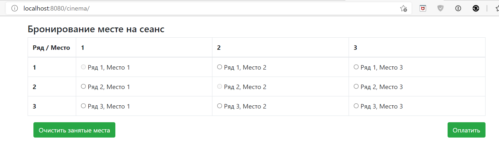
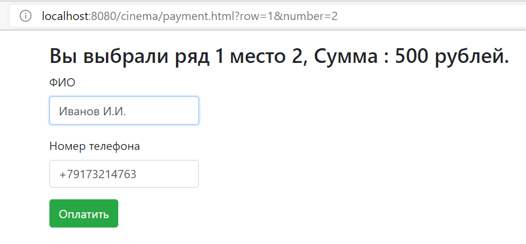
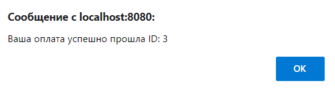

[](https://www.travis-ci.com/RomanRusanov/job4j_cinema)
[](https://www.codacy.com/gh/RomanRusanov/job4j_cinema/dashboard?utm_source=github.com&amp;utm_medium=referral&amp;utm_content=RomanRusanov/job4j_cinema&amp;utm_campaign=Badge_Grade)

# job4j_cinema

Приложение реализует логику покупки билетов на сеанс. Используя асинхронные запросы ajax.
После покупки места, это место больше не доступно для покупки другими пользователями.

### ScreenShot

Основная страница


Страница покупки


Подтверждение покупки


# Конфигурирование:

*   Для использования необходима заполнить username, password и имя бд(url)```src/main/resources/cinema_db.properties```
    схема бд будет создана при помощи liquibase
*   Необходим webserver при разработке использовался Tomcat ver.9.0.39

    url - http://localhost:8080/cinema/

    application context - /cinema

##Контакты:
*   skype: rusanov_roman
*   telegram: @Roman_Rusanov